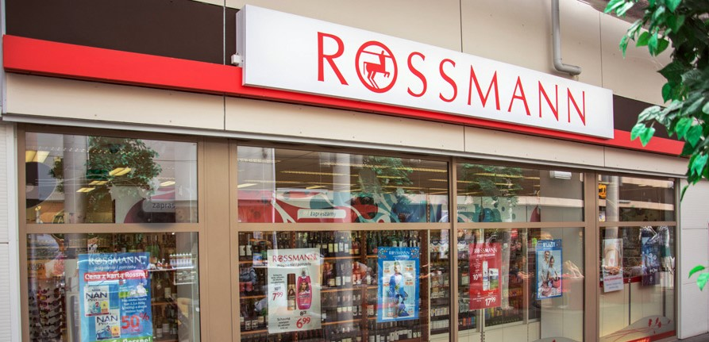

# Rossmann-Store-Sales
This project is a sales forecast using data from Rossmann, a German pharmacy chain that operates over 3,000 drug stores in 7 European countries.  Store sales are influenced by many factors, including promotions, competition, school and state holidays, seasonality, and locality.

# Project Context
The hypothetical commercial context that guides the project is basically to meet the request made by the CFO to the managers of each store. The request consisted of the revenue forecasts of the stores for the next six weeks because he wanted to reform the stores and wanted based on the amount of sales after six weeks of the store.

> - The reason behind the request: the CFO wants to anticipate a part of the stores revenue to invest on the stores reform;
> - Stakeholder: CFO
> - Solution Format:
>>- Granularity: daily sales by stores;
>> - Type of problem: Sales forecast;
>> - Main methods: Regression, Time series;
>> - Delivery method: Real time sales forecast of six weeks in a smartphone application.

# Dataset

The dataset is available on <a href="https://www.kaggle.com/c/rossmann-store-sales">Kaggle</a>.

> **About the Data**
>> - Id: Id that represents a (Store, Date)
>> - Store: Unique Id for each store
>> - Sales: The turnover for any given day
>> - Customers: Number of customers on a given day
>> - Open: Indicator for whether the store was open
>> - StateHoliday: Indicates a state holiday.
>> - SchoolHoliday: Indicates if the (Store, Date) was affected by the closure of public schools
>> - StoreType: Differentiates between 4 different store models
>> - Assortment: Describes an assortment level
>> - CompetitionDistance: Distance in meters to the nearest competitor store
>> - CompetitionOpenSince [Month/Year]: Gives the approximate year and month of the time the nearest competitor was opened
>> - Promo: Indicates whether a store is running a promo on that day
>> - Promo2: Is a continuing and consecutive promotion for some stores
>> - Promo2Since [Year/Week]: describes the year and calendar week when the store started participating in Promo2
>> - PromoInterval: describes the consecutive intervals Promo2 is started, naming the months the promotion is started a new

# Methodology
This project will be based on Cross-industry standard process for data mining (CRISP-DM). A standard idea about data science project may be linear: data preparation, modeling, evaluation and deployment. However, when we use CRISP-DM methodology a data science project become circle-like form. Even when it ends in Deployment, the project can restart again by Business Understanding. How might it help? It may help to avoid the data scietist to stop in one specific step and wast time on it. When all the project is completed the data scientist can return to initial step and do every step again. Therefore, the main goal it is to follow circles as it needs.

## Business Understanding
- In the business understanding stage was presented in the context of the project in which the CFO requested the sales forecast of each store for the next six weeks.

## Data Understandig
- At this stage a study of the database dimensions was carried out, evaluating missing values, as well as a statistical study, in addition to a survey of hypotheses that would implacate sales assumptions

## Data Preparation
- In this stage the transformation of variables and encoding of categorical variables was carried out, in addition, the selection of the most impacting features for the sales forecast was carried out.

## Modeling
- In the modeling stage it was made the sales forecast of the stores with different models, which were evaluated through a robust cross validation. From the results of the models, the hyperparameters were tuned to optimize the performance of each model and to be able to select the model with the best performance.

## Evaluation
- At this stage the sales forecast was simulated for the next six weeks and as the result achieved was satisfactory, it was decided to proceed with the Deploy.

## Deployment
- The deployment was done at Heroku, and two APIs were developed. One with the data cleaning pipeline and the other API with the communication with the Telegram Bot, communication application that allowed the CFO to access the sales forecast of each store in real time through the cell phone.

## Solution Diagram

